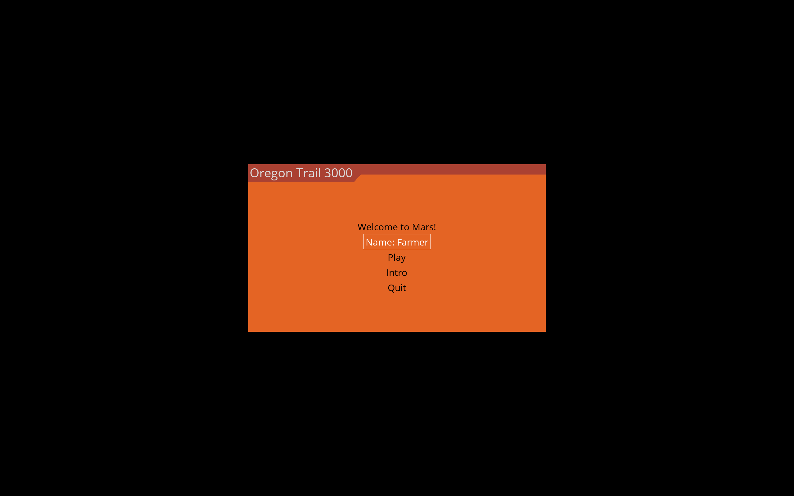

# Oregon Trail 3000
Create an engaging travel-themed video game that combines our newly developed skills with our individual pop cultural tastes.

## Team
Stephen Newby <https://github.com/TheSnewby/> 
Nash Thames <https://github.com/internashionalist> 
Tsim Muaj Yang <https://github.com/Jimwall0>

## Description
Oregon Trail 3000 is set in futuristic Mars where a family is migrating to New Oregon amidst a diabolic, demon incursion. The game is a playful celebration of two games from our early childhoods: Oregon Trail (1985) and DOOM (1993). Demons and Mars' treacherous landscape provide fertile ground for dangerous, wondrous encounters. The visuals and audio inspire both nostalgia and awe. 

## Tools
Oregon Trail 3000 was written in Python with the PyGame module and hosted through github. DALL-E was used for image generation.

## Demo
The Main Menu

The Mood-Setting Intro

A DOOM Encounter

A Mars Landscape Encounter

## Challenges
The main challenge was working with a module none of us had familiarization while trying to add as many flourishes and game mechanics within the temporal constraint. Getting the text boxes and visuals to fit on different screen resolutions was a challenge that took a few days as well. Fixing the audio quality to be good on different devices was also an issue.

## Learning Objectives
I learnt how to create a game from scractch! How to design and build the interface, how to add audio and visuals, how to make an immersive, engaging experience.

## Closing Statement
This project was really fun to work on. There was stress dealing with keeping the project minimal under the time constraint while also fitting every mechanic and aspect of the game we wanted. Audio was a stretch goal that came together the night before the presentation, which really pulled the experience together. I can see myself in the future working on projects like this for the sheer joy and reward.